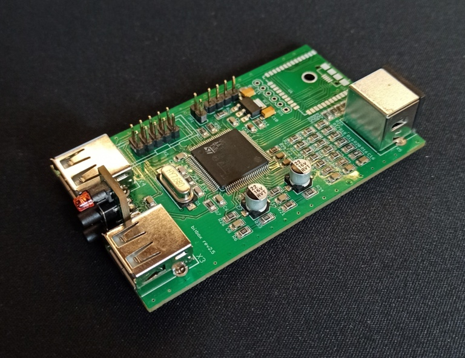

# Bitbox-Nano
This is an alternative PCB to makabuf's bitbox game console

## WARNING: this hardware has not been checked for functionality yet!!!

I want to use a special case for the console, so I created this version of the PCB.
I added an ESP32 which is also connected to the VGA signals and the STM32's SDWI interface lines. 
With this additions the ESP can program and debug the STM. It also can generate VGA signals, so hopefully you can also use the ESP VGA libs to generate video. You have to consoles in one device.

